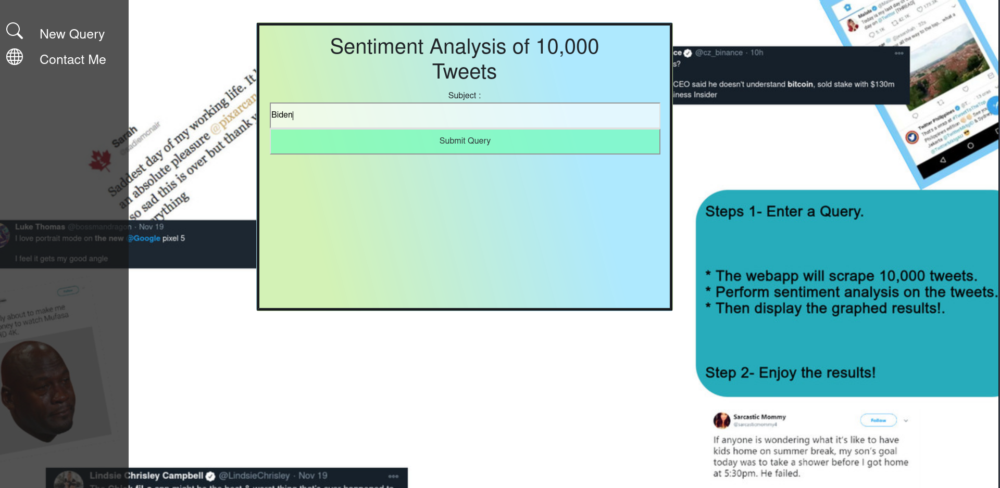
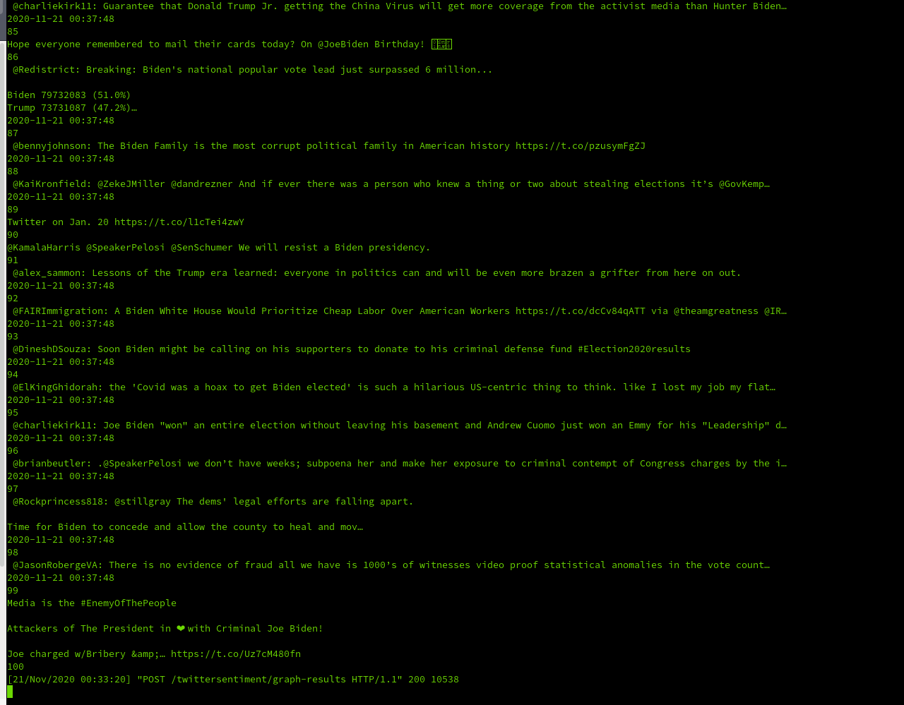
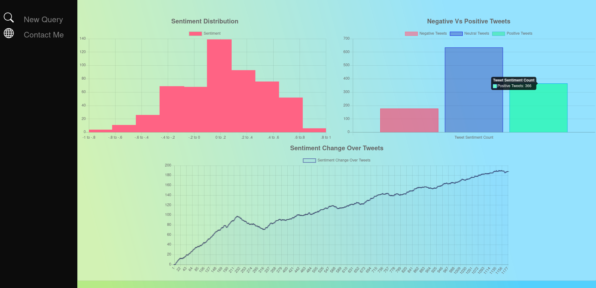

# Twitter-Feeler
## Goal: Build webapp that searches Twitter for a subject, scrapes tweets,does sentiment analysis on them and displays graphed results.

## Functionality: Enter a trending subject, 10,000 live tweets will be saved as they are tweeted, those tweets will have their sentiment analyzed and the results will be graphed.

# Home Page

### Process

# Results Page

